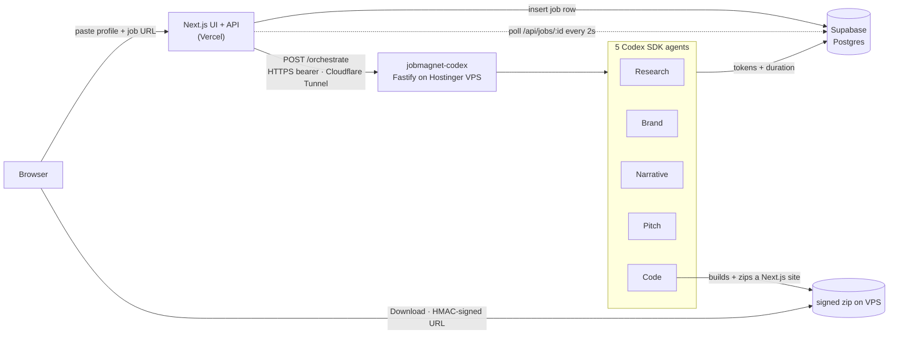

<div align="center">

# JobMagnet

**Paste your profile and a job link. Five OpenAI Codex agents build you a portfolio website in the target company's own brand — in ~96 seconds.**

[](https://jobmagnet-app.vercel.app)
[](https://github.com/aksheyw/jobmagnet-codex)
[](LICENSE)
[](#tech-stack)

[**→ Try the live demo**](https://jobmagnet-app.vercel.app) · [**→ Brand gallery (7 companies)**](https://jobmagnet-app.vercel.app/gallery) · [**→ A generated site (Stripe)**](https://jobmagnet-app.vercel.app/edit/FRxTzecthj)

</div>

---

## What this is

A working product, not a deck. Open the live link, paste your profile and a job URL, and ~96 seconds later you have a custom portfolio **website** themed in the target company's *real* brand colors and fonts — plus a tailored narrative and an optional PM-style product critique of the company. You download the Next.js project and deploy it to your own Vercel. **You own it; we don't host it.**

Built solo for the **OpenAI x Outskill AI Builders Hackathon**. The interesting part isn't another GPT wrapper — it's **five specialized Codex SDK agents** orchestrated end-to-end, using real `web_search`, strict JSON-schema output, and a sandboxed workspace.

> **Two repos, one product.** This repo (`jobmagnet-app`) is the **Next.js UI + API on Vercel**. The Codex agent runtime lives in the **[jobmagnet-codex](https://github.com/aksheyw/jobmagnet-codex)** "engine room" — because the Codex CLI is a **185 MB binary that exceeds Vercel's 50 MB function limit**, so it runs on a VPS. [See the architecture ↓](#architecture)

## Try it

| | Link |
|---|---|
| **Live app** | https://jobmagnet-app.vercel.app |
| **Brand gallery** — 7 companies, each in its own look | https://jobmagnet-app.vercel.app/gallery |
| **Codex usage** — live agent telemetry | https://jobmagnet-app.vercel.app/usage |
| **Demo — Sarvam** (minimal, lavender) | https://jobmagnet-app.vercel.app/edit/ptc4NPeQ6G |
| **Demo — Stripe** (systematic; Builder pitch) | https://jobmagnet-app.vercel.app/edit/FRxTzecthj |
| **Demo — Stripe** (Strategist pitch) | https://jobmagnet-app.vercel.app/edit/PxFgzb9RUh |
| **Engine-room health** | https://jobmagnet-codex.aksheywalia.in/health |

## The numbers

| Metric | JobMagnet |
|---|---|
| Time to a deployable, on-brand site | **~96 seconds** end-to-end |
| Codex agents in the pipeline | **5** — Research · Brand · Narrative · Pitch · Code |
| Token cost (MVP) | runs on the Codex CLI's **ChatGPT Plus OAuth** — no per-token API cost during the hackathon; production would use an OpenAI API key |
| Why a VPS instead of pure Vercel | the Codex CLI is **185 MB** > Vercel's **50 MB** function limit |
| Brand accuracy | the target company's *actual* colors + fonts, extracted live (Brandfetch → Codex `web_search` fallback) |
| Per-company look | a **distinct rendered template** — layout, typography, and mood derived from each brand, not one theme recolored ([see the gallery](https://jobmagnet-app.vercel.app/gallery)) |

Token + duration for every agent call is logged to Supabase `codex_usage` — these are measured, not estimated. (Smoke-test seed: Research ≈ 47K in / 1K out, 37s · Narrative ≈ 9.8K / 0.9K, 20s · Pitch ≈ 66K / 2.7K, 58s · Code = deterministic, 0 tokens.)

## Architecture



The app never imports `@openai/codex-sdk`. It inserts a job row, fires a fire-and-forget `POST /orchestrate` at the VPS (HTTPS bearer auth over a Cloudflare Tunnel), then polls Supabase for per-agent progress. The download streams from the VPS via an HMAC-signed URL. Three clouds — **Vercel** (UI + API), **Hostinger VPS** (Codex runtime), **Supabase** (Postgres telemetry + content) — at **no incremental infra cost** (all pre-existing / free-tier).

## How we used the Codex SDK

This is the part that matters for an OpenAI hackathon — not a thin wrapper, but deep, multi-agent use of `@openai/codex-sdk` (v0.133):

- **5 specialized agents**, each with its own prompt, schema, and tool set — orchestrated end-to-end (not one mega-prompt).
- **Live `web_search` + network access** on the Research, Brand, and Pitch agents to fetch real page content (verified by `webSearchQueries` count on every call).
- **Strict structured output** — 4 of 5 agents use `outputSchema` (JSON Schema), so we trust the shape instead of regex-parsing prose.
- **Sandboxed workspace** — the Pitch agent runs `workspace-write` to author SVG evidence; the Code agent copies a Next.js template, rewrites the Tailwind config + `next/font` imports + content JSON, builds, and zips — deterministically (0 LLM tokens).
- **Auth (MVP):** generations run via the Codex CLI's **ChatGPT Plus OAuth**, so there's no per-token API cost during the hackathon. Production would use an OpenAI API key.

## Tech stack

| Layer | Choice |
|---|---|
| Framework | **Next.js 16** (App Router) + **React 19** |
| Styling | **Tailwind CSS 4** + **shadcn/ui** (`base-nova`) |
| API | Next.js route handlers (Node runtime) |
| Data | **Supabase** Postgres (RLS) — `profiles`, `generation_jobs`, `generations`, `brand_cache`, `codex_usage` |
| Validation | **Zod 4** at every request boundary |
| Bridge | `fetch()` → **jobmagnet-codex** over Cloudflare Tunnel + HTTPS bearer auth |
| Hosting | **Vercel** (auto-deploy from `main`) |

## Engineering decisions worth calling out

1. **The VPS bridge is forced, not a preference.** The Codex CLI binary is 185 MB — well over Vercel's 50 MB function limit — and the Code agent needs a persistent shell + writable workspace + ~96s of runtime. So the agent runtime lives on a Hostinger VPS (Docker, Cloudflare Tunnel) while the UI/API stays on Vercel. Two deploy targets, one product. ([jobmagnet-codex →](https://github.com/aksheyw/jobmagnet-codex))
2. **Five specialized agents beat one mega-prompt** on every axis we measured — latency, token spend, output quality, and debuggability. Each agent is independently inspectable in `codex_usage`.
3. **Brandfetch → Codex `web_search` cascade.** Brandfetch nails well-known companies; the Codex fallback (with live search) catches the long tail. Two paths, one `BrandStyle` schema.
4. **You own the output.** We don't host generated sites — you download a real Next.js project and deploy it to *your* Vercel. No lock-in, no per-tenant infra to run.
5. **Security at the boundary.** User-supplied URLs pass an SSRF guard (no `file://`, no internal IPs); downloads are HMAC-signed with an expiry; the bridge is bearer-authed + rate-limited.

## Run locally

```bash
git clone https://github.com/aksheyw/jobmagnet-app.git
cd jobmagnet-app
npm install

# Create .env.local with the values the app needs:
#   - Supabase project URL + keys
#   - the jobmagnet-codex bridge URL + its shared bearer secret
# (The agent runtime lives in github.com/aksheyw/jobmagnet-codex.)

npm run dev   # http://localhost:3000
```

Generation requires a running **jobmagnet-codex** instance (the Codex agent runtime). The UI and editor run standalone against existing Supabase rows without it.

## Scope — MVP vs Final

The deliverable is the **portfolio website** (Lane A). Intentional MVP scope cuts (wired for Final, not promised here): LinkedIn-PDF parsing, magic-link email, `.docx`/PDF résumé + cover-letter *downloads*, and a 2nd template. Full deferred-work list lives in the project wiki.

## License

[MIT](LICENSE) — © 2026 Akshey Walia

---

<div align="center">

**Built by [Akshey Walia](https://www.linkedin.com/in/aksheywalia/)** · [LinkedIn](https://www.linkedin.com/in/aksheywalia/) · [aksheywalia.in](https://aksheywalia.in)

*The Codex agent runtime that powers this lives in [jobmagnet-codex](https://github.com/aksheyw/jobmagnet-codex).*

</div>
